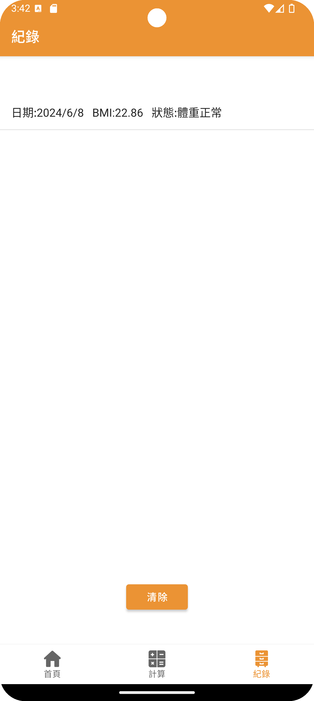

# SimpleBMITracker

## Description
SimpleBMITracker is a lightweight mobile app written in Java for recording and tracking your BMI (Body Mass Index) over time. This app allows users to input their weight and height, calculate their BMI, and keep a record of their BMI history for easy monitoring and health management.

| Main Page | Calculator | Record |
|-----------|-------------|--------|
|  |  |  |
